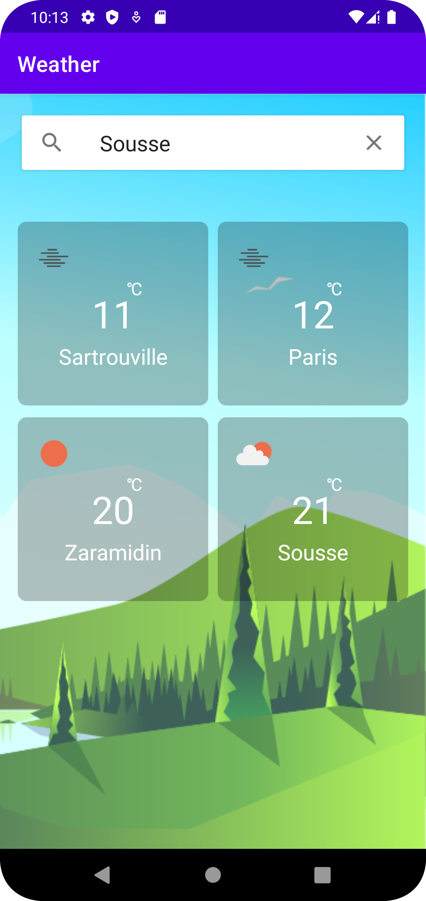

# Weather App

Weather app using OpenWeatherMap API with kotlin

#### The application includes:

- A view for adding a city

- A list displaying the list of cities added by the user

- A detail view displaying the various weather information of a city

## Requirements
#### API

Please use the following API for weather information:

https://openweathermap.org/api/one-call-api

Registration is required to use this API.
## Features

- Google Places, using google places to find city and get lat and long

## API Key
API keys is very secure data we can not publish it

- Google Places, you can change google places key from \gradle.properties
- Open Weathermap, you can change Open Weathermap key from \gradle.properties
#### Technologies

- Kotlin

- xml

- MVVM Design Pattern

- Room DataBase

- LiveData

- Coroutines

- Retrofit

- Google Places

#### IDE

Android Studio Flamingo | 2022.2.1

| Google places search | Screen 1 | Screen 2 |
| --------------- | ---------------- | ---------------- | 
|  |  |  |

## Architecture
This app uses [***MVVM (Model View View-Model)***](https://developer.android.com/jetpack/docs/guide#recommended-app-arch) architecture.

## License

Copyright (c) 2020 Raed Abada

Permission is hereby granted, free of charge, to any person obtaining a copy
of this software and associated documentation files (the "Software"), to deal
in the Software without restriction, including without limitation the rights
to use, copy, modify, merge, publish, distribute, sublicense, and/or sell
copies of the Software, and to permit persons to whom the Software is
furnished to do so, subject to the following conditions:

The above copyright notice and this permission notice shall be included in all
copies or substantial portions of the Software.

THE SOFTWARE IS PROVIDED "AS IS", WITHOUT WARRANTY OF ANY KIND, EXPRESS OR
IMPLIED, INCLUDING BUT NOT LIMITED TO THE WARRANTIES OF MERCHANTABILITY,
FITNESS FOR A PARTICULAR PURPOSE AND NONINFRINGEMENT. IN NO EVENT SHALL THE
AUTHORS OR COPYRIGHT HOLDERS BE LIABLE FOR ANY CLAIM, DAMAGES OR OTHER
LIABILITY, WHETHER IN AN ACTION OF CONTRACT, TORT OR OTHERWISE, ARISING FROM,
OUT OF OR IN CONNECTION WITH THE SOFTWARE OR THE USE OR OTHER DEALINGS IN THE
SOFTWARE.

## Support

For support, reach out to me at one of the following places!
- Linkedin [***Raed Abada***](https://www.linkedin.com/in/raed-abada/)
- Gmail raedabada95@gmail.com

